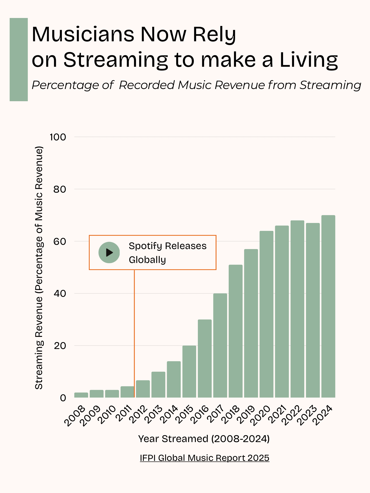

# Introduction

### Hi! I'm Katie Lynn Miller and I am a senior Journalism and Political Science major at Lehigh University. I am also an editor and columnist on the [Brown and White](https://thebrownandwhite.com/?s=katie+lynn+miller). Outside of writing my column [The Racket](https://thebrownandwhite.com/2025/09/11/spotify-killed-the-radio-star/) I hope that my journalistic practice and eventual career leads to a more equitable and inclusive world. 

### When I am not working on school, the Brown and White or at work at [Railroad Records](https://thebrownandwhite.com/2025/09/10/railroad-records-spins-a-new-community-hub-on-south-side/) or I'm spending time with my cat *Tummy*. 

# In Class Infographic Project 

# Infographic Project 

 

Using data from the [IFPI Global Music Report 2025](https://www.ifpi.org/wp-content/uploads/2024/03/GMR2025_SOTI.pdf) which contained a dataset that contained the amount of money that each recorded music platform made I wanted to create an infographic that tracked the growth of streaming. The reason that this is important is because this information is the basis of understanding the change in the recording industry that happened in the past decade. 

This exponential takeover of streaming as the predomonant way that people consume recorded music also has deeper connections to musicians being underpaid because on streaming platforms artists are making as little as [0.003 cents per stream](https://virpp.com/hello/music-streaming-payouts-comparison-a-guide-for-musicians/) of their song. 

In 2017 streaming beat physical media out, globally, as not just the way people were consuming music but the way that the recording industry was making money. This opens many more possible research questions about how this affects artists through what kind of music they make and where they put their energy. 
