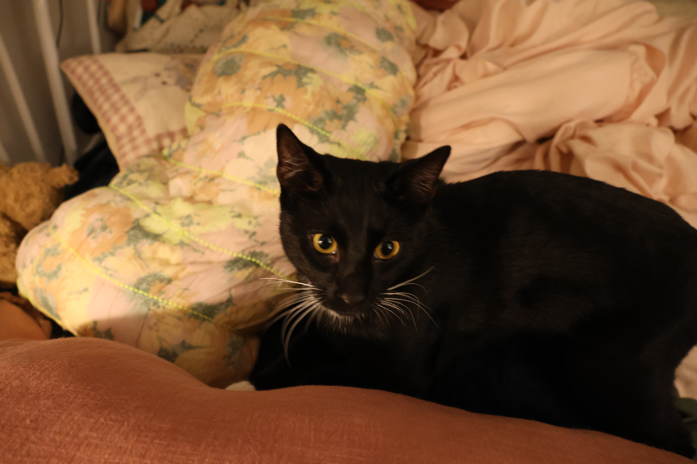
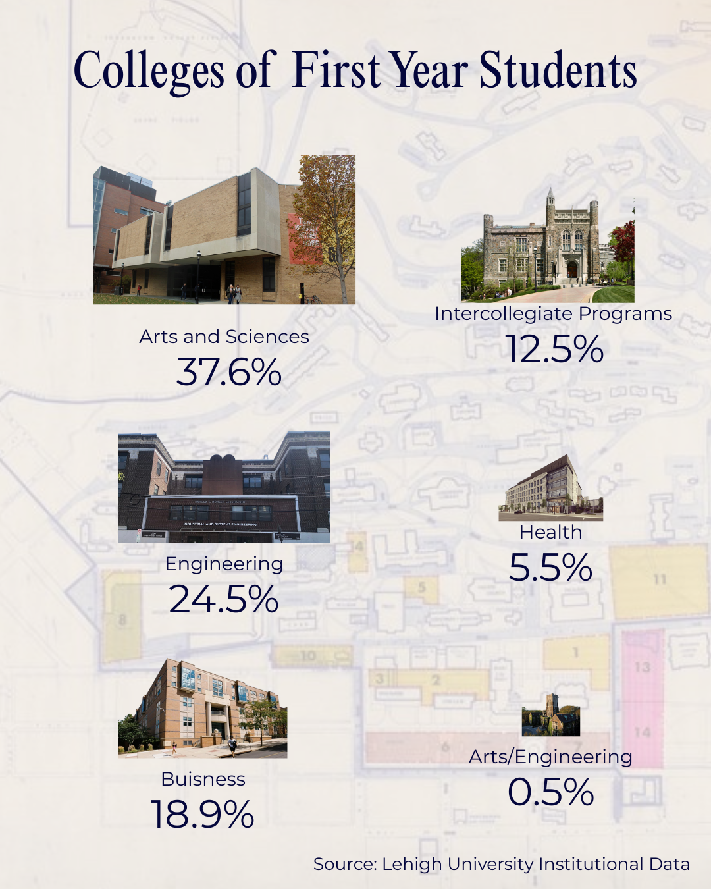

# Introduction

### Hi! I'm Katie Lynn Miller and I am a senior Journalism and Political Science major at Lehigh University. I am also an editor and columnist on the [Brown and White](https://thebrownandwhite.com/?s=katie+lynn+miller). Outside of writing my column [The Racket](https://thebrownandwhite.com/2025/09/11/spotify-killed-the-radio-star/) I hope that my journalistic practice and eventual career leads to a more equitable and inclusive world. 

### When I am not working on school, the Brown and White or at work at [Railroad Records](https://thebrownandwhite.com/2025/09/10/railroad-records-spins-a-new-community-hub-on-south-side/) or I'm spending time with my cat *Tummy*. 

# In Class Infographic Project 

# Infographic Project 

[Streaming Percentage Graph](UPDATEDSpotify Releases Globally.png)

Using data from the [IFPI Global Music Report 2025](https://www.ifpi.org/wp-content/uploads/2024/03/GMR2025_SOTI.pdf) I found that the exponential takeover of streaming as the predominant way that the music industry makes money, beating out physical media in 2017, describes a larger problem of musicians being forced to cater to an algorithm, for less pay than they were making before for record sold. 
